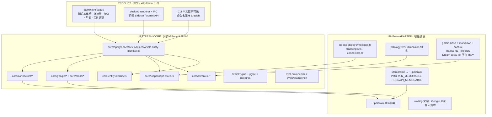
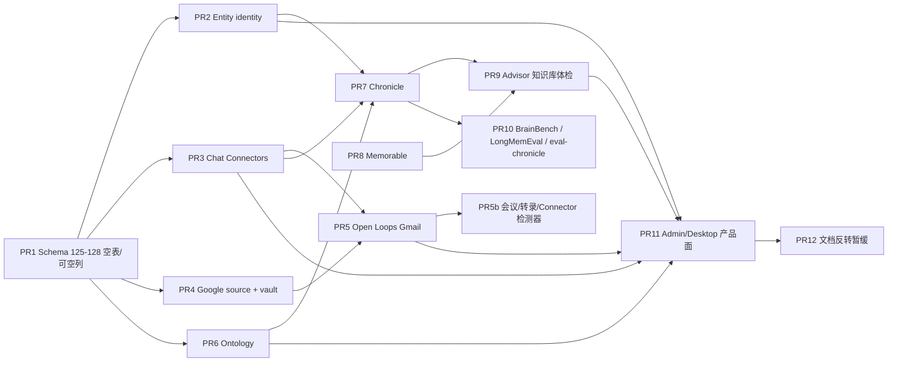
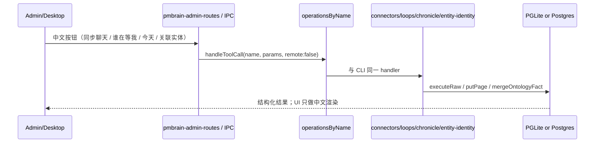

# PMBrain 吸收 GBrain 记忆与连接能力：底层架构设计

| 字段 | 值 |
|---|---|
| 作者 | Grok (planning) · 产品负责人已批准 |
| 日期 | 2026-09-12（批准）；2026-09-19 标记 implemented |
| 状态 | **Approved / implemented** |
| PMBrain 基线 | 设计时 Core `1.3.61` · Desktop `1.1.92` · Schema `124`；合入当前分支后 Core 继续递增 · Schema `130` |
| GBrain 基线 | `0.48.5.0`（本地树 `D:\cursor-claude\gbrain`） |
| 文档性质 | 底层架构变更批准件（CLI / MCP / Admin / Desktop 共用 Core） |

---

## Overview

PMBrain 已沿用 GBrain 的 RAG / Dream 骨架，但刻意暂缓了一批“个人长期记忆”能力：Chat Connectors、Open Loops、Life Chronicle、Ontology、跨 Source 实体身份、Memorable、Advisor 的 Chronicle 采集器、BrainBench。用户现在明确要求：**全部吸收、对齐 GBrain、并在 PMBrain 的 CLI + MCP + Admin + Desktop 上真正能用**。此前对比文档与评估把 Chronicle / `event_page_id` / `facts.dimension` / Memorable 标为「暂缓」或 D 类——**本文件推翻该暂缓，作为新的产品决定**。SkillOpt 与全局 basename Wikilink 仍明确不在范围内。

方案是三层移植，而不是重写：

1. **UPSTREAM CORE**：把 GBrain 0.48.5.0 的模块、schema（PMBrain 自有 125+ 编号）、engine 方法、ops、CLI、评测原样迁入。
2. **PMBrain ADAPTER**：只在 GBrain 无法直接工作时加适配层——`~/.pmbrain` 路径隔离、无默认 Embedding、中文本体别名、会议/转录/Connector 的 Open Loops 附加检测器（独立 job、分键、lane 隔离）、pack/markdown/capture 路由 `life/events` 与 `life/diary`（**不**加入 Dream `dream_synthesize_paths`）、产品中文文案。
3. **PRODUCT**：Admin / Desktop 复用 Core Operation / Admin API，不在 UI 复制业务逻辑。

**历史约束：** 在用户书面批准本设计之前，不开始实现。2026-09-19：已批准并落地。SkillOpt 与全局 basename Wikilink 仍不在范围内。

---

## Background & Motivation

### 当前状态（设计时 1.3.61 代码核实）

| 能力 | GBrain 0.48.5.0 | PMBrain 1.3.61 |
|---|---|---|
| Chat Connectors | `src/core/connectors/` + `src/core/ops/connectors.ts`（`localOnly`） | **无**该目录；仅有 ChatGPT 导出解析与 Admin `ChatGptTunnel`（MCP 隧道，不是 live sync） |
| Open Loops | `open_loops` + `loop_suppressions`（迁移 v144）；Gmail-first | **无**表、无 Google source kind |
| Life Chronicle | `src/core/chronicle/` + engine 读写 + `life/events/` | **无**；`timeline_entries` 无 `event_page_id`；`ALL_PAGE_TYPES` 无 `event`/`diary` |
| Ontology | `facts.dimension/value/value_hash/dim_status`（v122） | facts 已有双时态与 `kind=idea`（迁移 123）；**缺本体列** |
| Entity identity | `entity_identities`（v137），手工、union 默认 OFF | **无** |
| Memorable | 三开关 consent + `GBRAIN_MEMORABLE=0` | 1.3.47 明确未搬；仅文案里出现 “memorable phrasing” |
| Advisor | 12 个 collector，含 chronicle / writeback / brain-pack | 9 个 collector；Admin 知识页已有健康卡片；Desktop 无独立体检页 |
| BrainBench | `eval-brainbench.ts` + `evals/brainbench/` 完整语料 | `eval-run-all.ts` 列出 `brainbench` 但 **无命令、无 fixtures** |
| LongMemEval | `src/eval/longmemeval/` 约 16 个模块 | 命令存在，eval 目录仅 5 个文件 |

Home 隔离已在 1.3.61 落地：`~/.pmbrain`，不再自动复用 `~/.gbrain`。Connectors / Google vault / Memorable 必须遵守这一边界。

### 痛点

- 有道「张三」、会议「张总」、ChatGPT「张三」无法显式声明为同一人（多 Source 安全规则禁止自动合并，但缺少 GBrain 的手工 identity 表）。
- 承诺、待回复、未关闭事项只散落在 facts / 会议纪要里，没有 Gmail 线程状态机，也没有「谁在等我」的可信输出。
- 没有「那天发生了什么 / 去年今日 / 上次见到谁」的事件页时间线；现有 `extract-timeline-from-meetings.ts` 只在**实体页**上写 timeline 行，不是 Chronicle 的 `type:event` 页。
- 个人角色/项目状态随时间变化，facts 能存句子，不能解析「当前值」。
- 检索 / Dream / 记忆回归没有 BrainBench 门禁，开发质量会静默下滑。

### 与旧文档的关系（反转记录）

| 旧决定 | 出处 | 本设计 |
|---|---|---|
| Chronicle / `event_page_id` / `facts.dimension` 暂缓 | `docs/eval/PMBrain与原版GBrain的检索和Dream功能对比.md` §6 | **撤销暂缓，P1 吸收** |
| Chronicle 评为 D 类，不直接嫁接 | `项目管理/上游能力评估-Chronicle与SkillOpt.md` | **撤销**；进入条件已由本次用户指令满足 |
| 1.3.47 未搬 Memorable/Chronicle | `项目管理/变更台账.md` | **撤销** |
| Advisor Chronicle conflicts / brain-pack nag 暂缓 | 对比文档 Advisor 表 | Chronicle collector 随 Chronicle 一起上；brain-pack nag 按 GBrain 移植，缺 nag ledger 则一并移植，不编造 finding |
| SkillOpt 暂缓 | 同上 | **维持暂缓**（用户表未列） |
| Global basename Wikilink 不移植 | 对比文档 | **维持不移植** |

最后一枚 PR 必须改对比文档，不得继续写「暂缓」。

---

## Goals & Non-Goals

### Goals

- 吸收用户表中的 8 项能力，**一项不漏、一项不换成 PMBrain 捷径**。
- 底层是 CLI / MCP / Admin / Desktop 共用的 Core + Operation；UI 只调 API。
- Schema 只做加法，双引擎（PGLite + Postgres），编号从 **PMBrain 125** 起，**禁止复用** GBrain 122/137/144。
- 默认关闭一切会花模型钱或写知识页的自动通道（`auto_chronicle`、connector auto-sync、Memorable）。
- 中文 / Windows / 小白：Admin 与 Desktop 中文文案；CLI 保持高级面。
- 不删除、不覆盖、不批量改写用户原始资料、Wiki、已有向量。

### Non-Goals

- SkillOpt、全局 basename Wikilink、GitHub source kind（`--kind github`）、Voyage / Claude Fable / ZeroEntropy 运行时默认。
- 为大重构而拆散 `src/cli.ts` 或把整个 `operations.ts` 搬进 `src/core/ops/*`。
- 按中文名 / 相似度自动合并实体。
- 在 Desktop 里重写一套 Memorable CLI 或 Google OAuth 协议栈。
- 把 BrainBench 做成最终用户功能或新的检索引擎。
- 手机端 UI。
- 在批准前写任何实现代码。

---

## Key Decisions

| # | 决定 | 理由 |
|---|---|---|
| D1 | **批准前不写代码。** 本文件是底层架构批准件。 | `AGENTS.md`：底层能力/数据逻辑变更必须先确认。 |
| D2 | Entity identity **v1 仅手工**；检索 union 由 `entity_identity.union` 控制，**默认 OFF**。身份键是 `(source_id, slug)`。禁止按中文名/相似度自动匹配。 | 与 GBrain v1 及 PMBrain「当前 Source 精确匹配 → 仅回退 `default`」同时兼容；自动合并会静默污染检索。 |
| D3 | Schema 使用 **PMBrain 125+ 连续编号**，映射表见「Data Model Changes」。不复用 GBrain 121/122/137/138/139/144。PR1 只含可空列与空表（125–128）；**md5 索引改写（原拟 126）挪到 Chronicle PR 为 129+130**，与双引擎 `ON CONFLICT` 和 healer 同 PR。 | 两边版本空间已分叉。不能在 PR1 只改 unique index：PMBrain 引擎仍是 `ON CONFLICT (page_id, date, summary, source)`，会脑级写失败。也不能在 125 与 127 之间留空号：后补 126 永远不会跑。 |
| D4 | Connectors 凭证只活在 **`~/.pmbrain/connectors/<provider>.json` @0600**（目录 0700）。永不进 DB、`sources.config`、MCP 远程 payload。ops 标 `localOnly`。 | 对齐 GBrain；遵守 1.3.61 Home 隔离。 |
| D5 | Open Loops：**完整移植 Gmail 引擎**（Google source kind + vault + `loop-detect` + `loops-extract`），**再加**会议/转录/Connector 检测器。附加层不是替换。`waiting` / `open_loops` **只读**。无 Google 时 **不得**说「你已清零」。非 Gmail 写入走独立 job，默认不调度。 | 用户硬约束 12。读 op 写库会改 MCP 合同。`closeThreadLoops` 按 `(source_id, thread_id, detector)` 关闭；用 `thread_id` 前缀 + 元素级 `lane`（数组 JSON）过滤，避免 lane 互关。 |
| D6 | Chronicle 事件页写到 **`life/events/`**，日记 **`life/diary/`**。移植 pack 类型、`markdown.ts` 前缀、capture 路由、`extractable: false`。**禁止**把 `life/**` 加入 `dream_synthesize_paths`。Dream synthesize `put_page` 到 `life/diary/**` 必须拒绝。自动抽取默认 OFF。 | GBrain Chronicle 走 `engine.putPage`，不经过 Dream allow-list。PMBrain `put_page` 只在 `ctx.viaSubagent === true` 时强制 `allowedSlugPrefixes`（`operations.ts` L722–736）。把 `life/**` 加进 Dream 白名单会**新开** GBrain 没有的覆盖日记路径。 |
| D7 | Memorable **原样接入第三方 `memorable-cli`**，三独立 consent + 披露戳。路径改到 `~/.pmbrain`。Kill switch：`PMBRAIN_MEMORABLE=0` 为主，**同时承认** `GBRAIN_MEMORABLE=0`；任一为 0 即关闭（fail-closed）。不重写 closed-source CLI。 | 用户硬约束 8；第三方 CLI 可能读 GBrain 环境名。 |
| D8 | Advisor 产品名 **「知识库体检」**。复用现有 `runAdvisor` / `getAdminAdvisorReport`。`--apply` 维持 allowlist。不发明 collector 撑不起来的 finding。 | Admin 知识页已有健康卡片，升格为体检，而不是第二套引擎。 |
| D9 | BrainBench 是 **CLI/eval 移植**（命令 + in-tree fixtures/gold/schema/harness），不是新检索引擎。LongMemEval 对齐 GBrain 0.48.5.0 剩余缺口，同时保留 `docs/eval/PMBrain检索与Dream质量评测规范.md`。 | 开发质量门禁；Desktop 最多「运行质量检查」去调 CLI。 |
| D10 | SkillOpt **继续不在范围**。 | 用户表未列。 |
| D11 | Global basename Wikilink **继续不移植**。 | 与多 Source 安全冲突。 |
| D12 | `operations.ts` **不大拆**。仅抽出 `ops/contract.ts`（类型，避免循环），新增能力以独立 `src/core/ops/*.ts` 注册进现有 `operations` 数组。 | 对齐 AGENTS.md「保持上游骨架，向外抽增量」。 |
| D13 | Autopilot `connector-sync` **默认 OFF**（须 `connectors.<p>.auto_sync=true`）。`auto_chronicle` **默认 OFF**。 | 用户硬约束 15、16。 |
| D14 | 无 chat 模型时 Chronicle judge / loops LLM extract **fail-open 跳过**（`judge_llm_unavailable` / 不写空成功）。无 Embedding 时不启动向量化。 | 对齐 GBrain #2608；遵守 PMBrain 无默认向量供应商。 |
| D15 | 远程日记脱敏与 Chronicle **同 PR 交付**，不是后续加项。`ctx.remote !== false` 过滤 `life/diary/`。 | 用户硬约束 11。 |
| D16 | `detector` CHECK **保持** GBrain 三值。Gmail 的 `deterministic_thread` **只表示 Gmail 线程状态机**。`open_loops.evidence` 保持 GBrain 形状：**JSONB 数组** `LoopEvidence[]`（`DEFAULT '[]'`），**禁止**包成 `{lane, items}`。可选 `lane` 打在**每个数组元素**上。`closeThreadLoops` 增加第 6 参 `lane?`，SQL 用数组感知 JSON。`thread_id` 按 lane 加前缀。mute 仍 `sender\|thread`。 | 根上 `evidence->>'lane'` 对数组恒为 NULL：Gmail 关闭会匹配 0 行，NULL-lane 分支会关掉所有 lane。 |
| D17 | `extract-timeline-from-meetings.ts` **保留**。Chronicle 另写 event 页 + `event_page_id` 投影，不替换实体页时间线。 | 两者语义不同；替换即打折。 |
| D18 | Admin `ChatGptTunnel` **不是** Chat Connector。两者并存。 | 隧道是把 MCP 暴露给 ChatGPT；Connector 是把 ChatGPT/Claude **历史拉进知识库**。 |
| D19 | **Q1 锁定为 A（2026-09-12）。** Desktop/Admin v1 提供「连接 Google」。IPC：renderer → main → Sidecar `pmbrain google connect --json` → stdout `JsonEnvelope`。loopback 只在 Sidecar；renderer 看不到 authorization code、带 code 的 redirect、client_secret、refresh_token。Windows 防火墙挡住 loopback 时走 GBrain 已有的粘贴-redirect `next_action`，不在 Electron 再绑端口。**禁止**第二套 Electron OAuth。CLI `pmbrain google connect` 仍是权威实现。 | 用户选定 A。与 AGENTS.md「Desktop IPC 只转发」一致。 |
| D20 | `chronicle.tz` 默认 **UTC**（对齐 GBrain）；Admin/Desktop 可设 `Asia/Shanghai`。中文日期进 judge prompt 适配层。 | 引擎对齐；产品层解决中国用户时区。 |
| D21 | 实现按 PR 切分；每完成一次用户要求的变更，根 `package.json` + `VERSION` 最后一位 +1（从 **1.3.62** 起算），桌面改则同步 `desktop/package.json`，中文倒序写入 `项目管理/变更台账.md`。 | 现有版本规则；本文不预编后续具体版本号。 |
| D22 | **Q2 锁定为分键。** `loops.extraction_enabled` **只服务 Gmail**，默认 ON（对齐 GBrain，且有 30 天窗 + ceiling 500）。`loops.meeting_extraction_enabled`、`loops.transcript_extraction_enabled`、`loops.connector_extraction_enabled` **默认 OFF**。确定性检测器在 scan job 内默认跑，但 job **默认不调度**。 | GBrain 的 extract-ON 只因为消费者是 google-source 线程。共用一键会把会议语料变成默认烧 token，违反「默认关闭会花钱的自动通道」。 |
| D23 | MCP `localOnly` 必须三闸，与 GBrain WP1/D7 对齐：(1) HTTP catalog 过滤；(2) `dispatchToolCall` 非 `stdio` → unknown-tool；(3) handler `ctx.remote`。第一批 localOnly ops（PR2）就移植 dispatch + `http-transport.ts` 过滤。 | PMBrain `serve-http.ts` 已过滤；`mcp/http-transport.ts` L142 与 `dispatch.ts` **没有** transport/localOnly 闸。只靠 handler 会在漏写时把 `connector_sync` / `entity_identity_link` 暴露给 HTTP。 |

---

## Unified Architecture

### 三层边界



### 能力依赖图



Ontology schema（facts 列）必须先于 Chronicle 写入器。Google source 必须先于 Gmail loops。Connectors 必须先于 Connector 来源的 loops。Chronicle 必须先于 Advisor 的 `collect-chronicle` 与 `eval-chronicle`。

### operations 注册（不大拆 operations.ts）

GBrain 已把 ops 抽到 `src/core/ops/*`，由 `operations.ts` spread。PMBrain 的 `src/core/operations.ts` 仍是单体（`export const operations` 约 L5224），且 **没有** `src/core/ops/`。

**允许的最小抽取：**

1. 新增 `src/core/ops/contract.ts`：只搬 `Operation` / `ParamDef` / `OperationContext` / `Logger` / `AuthInfo` 类型；`OperationError` 已在 `src/core/operation-error.ts`，从此处 re-export。
2. `operations.ts` 改为从 `ops/contract.ts` re-export，**现有 importer 不变**。
3. 新增四个模块（禁止把 pages/search/facts 整簇搬走）：
   - `src/core/ops/connectors.ts`
   - `src/core/ops/loops.ts`
   - `src/core/ops/chronicle.ts`（含 ontology_* ops，与 GBrain 同簇）
   - `src/core/ops/entity-identity.ts`
4. 在 `operations` 数组中 **按 GBrain 0.48.5.0 `src/core/operations.ts` L181–215 的相对顺序 splice**（PMBrain 是单体数组，按**现有相邻符号**插入，不要猜）：

   ```
   salience + get_recent_transcripts + connectorsOperations
   → chronicleOperations
   → volunteer_context
   → extractionOperations（若尚未抽出，则插在 PMBrain 现有 extract 相关 op 之后）
   → entityIdentityOperations          // 紧挨 facts 簇之前，不是 extract_facts 之后
   → facts / extract_facts / recall / forget_fact
   → …其余现有簇保持不动…
   → loopsOperations                   // 数组最末，与 GBrain 相同
   ```

   PMBrain **没有** GBrain 的 `OP_AREAS` walker，也 **没有** `test/mcp-tool-defs.test.ts` 那种「每个非 localOnly op 必须有 area」的检查。**不要发明 `OP_AREAS`。** 若后续某次上游同步把 walker 带进来，再按 GBrain 名注册：`chronicle_*`→`chronicle`，`ontology_*`→`ontology`，`entity_identity_*`→`entities`，`open_loops`/`loops_*`→`loops`。connectors 在 GBrain 为 localOnly，本来就不进 area 强制集。

5. 新模块 **不得** `import from '../operations.ts'`（环）。只从 `ops/contract.ts` 和 core 实现模块导入。

MCP 分发：stdio 走 `src/mcp/server.ts` 的 `handleToolCall`；HTTP 走 `src/mcp/http-transport.ts` → `dispatchToolCall`（`src/mcp/dispatch.ts`）。**不是**「operationsByName 自动安全」。GBrain 三闸必须在 **第一批 localOnly op（PR2）** 落地：

1. Catalog：`http-transport.ts` 在 `filterOpsForSurface` 之前 `operations.filter(op => !op.localOnly)`（`serve-http.ts` 已有，http-transport 今天没有）。
2. Dispatch：`DispatchOpts.transport: 'stdio' | 'http'`；`op.localOnly && transport !== 'stdio'` → 与未知工具相同的 unknown-tool 信封。
3. Handler：`ctx.remote === true` → `permission_denied`（GBrain connectors 已有）。

测试：HTTP `tools/list` 不含 `connectors_status` / `connector_sync` / `entity_identity_link` / `chronicle_backfill`；`tools/call` 返回 unknown-tool。stdio 仍列出并允许本地调用。

### Desktop / Admin 如何复用



- Admin 路由继续集中在 `src/commands/pmbrain-admin-routes.ts`。
- Advisor 已有 `GET /admin/api/advisor` + `POST /admin/api/advisor/apply`（`src/commands/admin-advisor.ts` → `runAdvisor`）。知识库体检复用这条链。
- Desktop IPC（`desktop/src/main/ipc-handlers.ts`）不得实现检测/抽取；只转发 Sidecar 的 Operation 或 Admin API。
- 凭证类动作（connectors auth、google connect）保持 host-local；Desktop 调同一 CLI/Core，不把 cookie/token 送进渲染进程。
- Google OAuth（**D19 / Q1=A 已锁定**，PR11）IPC 合同：

  ```
  renderer「连接 Google」
    → ipcMain（不跑 OAuth）
    → Sidecar 子进程：`pmbrain google connect --json`（argv 与 CLI 完全相同）
    → loopback 监听在 Sidecar，不在 Electron
    → 浏览器由 Sidecar 打开（GBrain `openBrowser` / `--no-browser` 打印 URL）
    → Sidecar stdout：GBrain `JsonEnvelope` `{ ok, status, next_action?, error? }`
    → main 只把该 JSON（及 `[SHOW USER]` 文案）回给 renderer
  ```

  renderer **永远看不到** authorization code、带 code 的 redirect URL、client_secret、refresh_token。`client_id` 走 GBrain 已有摄入：`--client-json` / `GOOGLE_CLIENT_ID`+`SECRET` / vault，不进 renderer。Windows 防火墙挡住 loopback 时 Sidecar 返回 `next_action` 指向粘贴 redirect（GBrain 已有），UI 显示同一 JSON，不在 Electron 里再绑一个端口。

---

## 八项能力

### 1. Chat Connectors（P0）

#### GBrain 真相源

| 面 | 路径 |
|---|---|
| Core | `src/core/connectors/{types,registry,credentials,client,spool,sync,config-keys,oauth-pkce,classify}.ts`；`providers/chatgpt.ts`、`providers/claude.ts` |
| Ops | `src/core/ops/connectors.ts`：`connectors_status`、`connector_sync`；二者 `localOnly: true`，credentials 永不返回 |
| CLI | `src/commands/connectors/{index,auth,status,sync}.ts`：`gbrain connectors auth\|status\|sync\|logout\|providers` |
| 凭证 | `~/.gbrain/connectors/<provider>.json` @0600；env `GBRAIN_CONNECTOR_<PROVIDER>_COOKIE/_TOKEN` 优先于文件 |
| 同步管线 | credential → probe → watermark（**config 标量** `connectors.<p>.watermark_iso`，**不是** `op_checkpoint`，避免 7 天 GC）→ list → fetch → spool 原生导出 JSON → `runTranscriptsIngest` → 仅全干净才推进 watermark |
| 作业 | minion `connector-sync`；Autopilot 仅当 `connectors.<p>.auto_sync` 为真才派发 |
| 测试 | `test/connectors-*.test.ts` 等（凭证、spool、sync orchestrator、ops localOnly） |

Perplexity 有意不进 registry（无 transcript adapter）。

#### PMBrain 缺口

- 无 `src/core/connectors/`。
- `conversation-parser/builtins.ts` 已有 `chatgpt-export-you-chatgpt`，可吃官方导出；**没有 live session sync**。
- Admin `ChatGptTunnel.tsx` 是 MCP 隧道，不是历史同步。
- Home 已是 `~/.pmbrain`（`pmbrainPath` / `gbrainPath` 都指向 `configDir()`）。

#### 移植计划

**原样移植（UPSTREAM CORE）：**

- 整个 `src/core/connectors/`（含 chatgpt/claude providers、spool、sync、oauth-pkce）。
- `src/core/ops/connectors.ts`、`src/commands/connectors/`。
- Doctor check `src/commands/doctor/checks/connectors.ts`。
- Autopilot：移植 `maybeDispatchConnectorSyncs` 到 `src/commands/autopilot-fanout.ts`，并在 `src/commands/autopilot.ts` 调用（GBrain 即此结构）。`auto_sync` 默认 OFF，故新调用点在配置前是 no-op。
- `jobs.ts`：移植 `refreshGatewayForJob`（GBrain `jobs.ts` L64–71：`refreshGatewayEnvFromFilePlane` + `reconfigureGatewayWithEngine`，**禁止** `configureGateway(buildGatewayConfig(loadConfig()))` 以免冲掉 DB-plane）。PR3 用它包 `connector-sync`；PR5 的 `loops_extract` / `loops_scan_meetings`、PR7 的 `chronicle_extract` 复用同一 helper。PMBrain 继续 `worker.register`，不要为了对齐而发明 `registerBuiltinJob` 名，但 gateway 刷新语义必须相同。

**PMBrain 适配：**

- `connectorsDir()` 使用 `pmbrainPath('connectors')` → `~/.pmbrain/connectors`。
- Env 名：主读 `PMBRAIN_CONNECTOR_<PROVIDER>_COOKIE/_TOKEN`，**同时读** `GBRAIN_CONNECTOR_*`（兼容从 GBrain 抄来的脚本）；PMBrain 名优先。
- Embed kickoff：未配置 `embedding_model + embedding_dimensions` 时 `embedKickoff='none'`，不得回退 ZeroEntropy。
- Spool 仍走现有 `runTranscriptsIngest` / conversation-parser（已支持 ChatGPT 导出）。写入 `conversations/<provider>/`，与 filing rules 中已有 `conversations/` 一致。
- 不把凭证写入 Desktop userData 或 `sources.config`。

#### 数据 / 迁移

- **无新表。** watermark / last_sync_at / auto_sync / auth_error_at 走 `config` 表（GBrain `KNOWN_CONFIG_KEY_PREFIXES` 已有 `connectors.`）。PMBrain `config.ts` 同步登记该前缀。
- Spool 是 0600 临时文件，ingest 后 `finally` 删除。

#### 默认

- `auto_sync` **OFF**。
- Autopilot 不派发，除非用户显式打开。
- Auth 是 CLI 交互（cookie 粘贴为主，chatgpt `--try-oauth` best-effort），**不是** MCP op。

#### 表面

| 面 | 行为 |
|---|---|
| CLI | `pmbrain connectors …`（命令与 GBrain 同） |
| MCP | `connectors_status` / `connector_sync` 仅本地；远程 → unknown-tool 或 `permission_denied` |
| Admin | 「聊天记录同步」：状态（无密钥）、同步按钮调 `connector_sync` |
| Desktop | 设置页包装同一 API；cookie 只在主进程/CLI 输入，不进 renderer |

#### 测试

- 先写：凭证 0600、env>file、remote 调用被拒、watermark 仅 clean run 前进、dry-run 不写页、无 Embedding 不 kickoff。
- PGLite 单测 + Postgres 引擎对等（ingest 路径）。
- 禁止测试里设置 `DATABASE_URL`（沿用现有 wrapper）。

#### 风险与「打折」

| 严重度 | 风险 | 缓解 |
|---|---|---|
| 高 | 凭证进 DB / MCP | `localOnly` + runtime remote 闸 + 测试钉死 |
| 高 | 只做「导出 zip 再 import」文档 | **不算吸收**；必须 live sync |
| 中 | watermark 误用 op_checkpoint | 必须 config 标量 |
| 中 | Windows chmod 0600 弱 | 与 GBrain 相同 best-effort；Doctor 报告 mode |

**打折清单：** 只支持手动导出；把 cookie 存进 `sources.config`；远程 MCP 能 sync；用 ChatGptTunnel 冒充 Connector。

---

### 2. Open Loops（P0）

#### GBrain 真相源

| 面 | 路径 |
|---|---|
| Store | `src/core/loops/loops-store.ts`（双引擎同一 SQL） |
| Schema | `open_loops` + `loop_suppressions`（v144）；`detector CHECK (deterministic_thread, llm_extract, manual)` |
| Gmail 引擎 | `src/core/google/{google-source,loop-detect,loops-extract,google-clients,google-render,access,types}.ts` |
| Vault | `src/core/creds/vault.ts` → `~/.gbrain/credentials.json` @0600；`providers/google.ts` |
| Source kind | `gbrain sources add --kind google --account <email>`（`src/core/sources-ops.ts` Path D；`src/commands/sources.ts`） |
| Google CLI | `src/commands/google.ts`：`connect/status/calendars/disconnect`；`google-setup.ts` |
| Ops | `src/core/ops/loops.ts`：`open_loops`（可读远程，但证据脱敏）、`loops_close`、`loops_mute`、`loops_unmute` |
| CLI | `gbrain waiting`、`gbrain loops list\|show\|done\|drop\|mute\|unmute`；默认 span `__all__`（不是 `default`） |
| 检测 | 零 LLM 线程状态机：inbound 24h / outbound 72h grace；噪声/日历/List-Unsubscribe/self-thread/CC-only 排除；`loops mute` 只拦新开 |
| LLM 半 | `loops-extract.ts`：每线程一次模型；同时写 `open_loops` + `facts.kind=commitment`（`fact_id`）+ typed edge；`loops.extraction_enabled` 默认对 google 源 ON；无模型 skip |
| 新鲜度 | Google 源 24h 未 sync → `stale`；CLI 拒绝除非 `--stale-ok`。「stale-but-confident 比没有更糟」 |
| 无 Google | 已有文案：*NOT "inbox clean"*（`ops/loops.ts` `renderText`） |

#### PMBrain 缺口

- `sources add` **不支持** `--kind google` 或 `--kind github`（本设计只补 google）。
- 无 `src/core/google/`、`src/core/creds/`、`src/core/loops/`。
- 无 `waiting` / `loops` CLI。
- 已有 `facts.kind=commitment` 与会议导入，**不是** Open Loops。

#### 移植计划

**原样移植：**

- `core/google/*`、`core/creds/*`、`core/loops/loops-store.ts`、`ops/loops.ts`、`commands/{loops,google,google-setup,google-setup-tail,creds,sync}.ts`（**`sync.ts` 的 `kind==='google'` 分发是 PR4 的运行时入口**，GBrain L1334–1340）。
- `sources-ops.ts` 增加 Path D `--kind google`（账户指针进 `sources.config`，token 只在 vault）。
- `jobs.ts` 注册 `loops_extract`。
- Doctor `google-oauth` + `chronicle` 无关的 google 检查。
- 同步顺序：contacts → calendar → gmail（先有 alias 再解析对手方）。

**PMBrain 适配（附加检测器，不是替换）——可实现规格：**

##### 读/写边界

- `waiting` / `open_loops` **只读**（GBrain `annotations.readOnlyHint: true`）。禁止在 read handler 里跑检测器。
- Gmail 写入点保持上游：`runGoogleSync` 内 `loop-detect` + 入队 `loops_extract`。
- 非 Gmail 写入点：**独立 minion** `loops_scan_meetings`（同一 handler 用 `lane` 参数扫 meeting / transcript / connector，避免三个几乎相同的 job 名）。
  - 触发：显式 `pmbrain loops scan [--lane meeting|transcript|connector|all]`；或用户打开 `loops.meeting_scan_auto`（**默认 false**）后，import/sync 成功才入队。
  - **默认不进 Autopilot。**
  - 确定性检测器在 job 内默认跑（零 LLM）。LLM 半受分键控制（D22）。

##### `thread_id` 命名空间（强制）

GBrain `closeThreadLoops`（`loops-store.ts` L187–204）按 `(source_id, thread_id, detector='deterministic_thread')` 关闭，**没有** lane 过滤。因此：

| lane | `thread_id` 格式 | 例 |
|---|---|---|
| google | Gmail 原生 thread id（上游不变） | `18c4a…` |
| meeting | `meeting:<page_id>` | `meeting:4421` |
| connector | `connector:<provider>:<provider-conversation-id>` | `connector:chatgpt:abc` |
| transcript | `transcript:<source_id>:<path-hash>` | `transcript:default:a1b2c3d4` |

`source_id` 隔离**不够**：会议与 Connector 常落在同一 `default` source。前缀是主隔离；lane 是纵深防御。

##### `closeThreadLoops` 改动（`loops-store.ts`；Gmail 调用点改第 6 参）

GBrain `evidence JSONB NOT NULL DEFAULT '[]'`，`LoopEvidence[]`（`message_id` / `page_slug` / `quote`）。`normalizeRow` 与所有消费者按**数组**解析。

**禁止**把数组改成 `{lane, items:[...]}`。在 `LoopEvidence` 上增加可选字段：

```ts
lane?: 'google' | 'meeting' | 'transcript' | 'connector';
```

Gmail apply（`loop-detect.ts` upsert）对**每个**元素打标：

```ts
evidence: spec.evidence.map((e) => ({
  ...e,
  lane: 'google',
  ...(pageSlug ? { page_slug: pageSlug } : {}),
}))
```

会议/转录/Connector 同理，元素上 `lane: 'meeting'|'transcript'|'connector'`。空数组仍合法（无 quote 的确定性 loop）；此时用 `thread_id` 前缀隔离，close 的 lane 过滤见下（空数组视为 google/未打标，仅 `$lane` NULL 或 `'google'` 可关）。

签名扩成第 6 参，**不得**占用第 5 参 `only`（GBrain `loop-detect.ts` L235 已传 `toClose: LoopType[]`）：

```ts
closeThreadLoops(
  engine, sourceId, threadId, closedBy,
  only?: LoopType[],
  lane?: 'google' | 'meeting' | 'transcript' | 'connector',
): Promise<number>
```

Gmail 调用改为：

```ts
await closeThreadLoops(engine, sourceId, thread.threadId, 'reply_detected', toClose, 'google');
```

非 Gmail 传对应 lane。SQL 在现有 `(source_id, thread_id, status='open', detector='deterministic_thread', only)` 上追加**数组感知**谓词（双引擎同一文本；`$N::text::jsonb` 绑定）：

```sql
AND (
  ($6::text IS NULL AND (
    jsonb_typeof(evidence) IS DISTINCT FROM 'array'
    OR jsonb_array_length(evidence) = 0
    OR evidence->0->>'lane' IS NULL
    OR evidence->0->>'lane' = 'google'
  ))
  OR (
    $6::text IS NOT NULL
    AND evidence @> jsonb_build_array(jsonb_build_object('lane', $6::text))
  )
)
```

- `$6 = 'google'`：只关元素带 `lane=google` 的行（`@>` 匹配数组中任一对象）。Gmail 回复**必须**能关掉「evidence 仍是 quote 对象数组」的 google 行。
- `$6 = 'meeting'` 等：只关该 lane；**不能**关掉 `thread_id = meeting:<id>` 之外却被误打的行，也**不能**关掉 google 行。
- `$6` NULL：只碰未打标 / google（`evidence->0->>'lane'` 缺失或 `'google'`，或空数组）。不得关掉 `lane=meeting` 行。
- **Gmail 的 `deterministic_thread` 语义不变**。

没有在元素上打 lane 的 insert 视为实现 bug（测试拒绝），但 SQL 仍按上式 fail-safe。

##### mute

保持 GBrain CHECK `kind IN ('sender','thread')` 与 ops 参数。value **规范化小写**后写入，语法：

| 场景 | kind | value |
|---|---|---|
| Gmail 发件人 | `sender` | 邮箱（上游不变） |
| Gmail 线程 | `thread` | Gmail thread id |
| 人物（会议/转录/Connector） | `sender` | `slug:<source_id>:<entity-slug>` |
| 会议页 | `thread` | `meeting:<page_id>`（与 thread_id 相同） |
| Connector 会话 | `thread` | `connector:<provider>:<id>` |
| 转录文件 | `thread` | `transcript:<source_id>:<path-hash>` |

检测器在开新 loop 前查 suppressions：`sender` 对 `slug:…` 或 email 精确匹配；`thread` 对完整 thread_id 精确匹配。mute 仍只拦新开，不改已有行（对齐 GBrain）。

##### 花费信封（分键，D22）

| 键 | 默认 | 窗 / 顶 | 消费者 |
|---|---|---|---|
| `loops.extraction_enabled` | ON | `LOOPS_EXTRACT_WINDOW_DAYS=30`，`LOOPS_EXTRACT_ENQUEUE_CEILING=500` | **仅** google-source 线程（GBrain 原样） |
| `loops.meeting_extraction_enabled` | **OFF** | 同样 30 天（`pages.updated_at`）+ ceiling 500 | meeting LLM |
| `loops.transcript_extraction_enabled` | **OFF** | 同上 | 非 google 的 conversation |
| `loops.connector_extraction_enabled` | **OFF** | 同上 | `conversations/chatgpt\|claude/` |
| （无键）确定性 scan | job 内 ON | 同一 30 天窗；无模型调用 | 所有非 Gmail lane |

无 chat 模型：LLM 半 skip，不当成 0 loops 成功。

##### 对手方解析（Source-local；对齐 GBrain Gmail）

**不要**调用 `resolveEntitySlug`：该函数对非空输入**永不失败**，底层是 `fallback_slugify`，会把未匹配的「张总」写成 `zhang-zong` 并污染 waiting / mute / entity-card。

与 GBrain `loop-detect.ts` L241–245 相同：

```ts
const resolved = await resolveEntitySlugWithSource(engine, page.source_id, name);
const counterpartySlug =
  resolved && resolved.source !== 'fallback_slugify' ? resolved.slug : null;
```

- 空输入：`resolveEntitySlugWithSource` 返回 `null` → `counterparty_slug=null`。
- `source === 'fallback_slugify'`：`counterparty_slug=null`，保留显示名 / `counterparty_email`，**不**持久化 slugify 结果。
- 接受 `exact_page` / `fuzzy_match`（以及若解析器已有的 `alias_exact`）。
- **不**读 `entity_identities`，**不**跨 Source，**不**走 identity union。

##### 与已有 commitment facts 去重

- Gmail：`loops-extract.ts` 继续 `writeSingleFact` + `open_loops.fact_id`。**代码化** GBrain 注释「`extract_facts` never runs separately on google-source email pages」：`runFactsBackstop` / `isFactsBackstopEligible` 在 `sources.config.kind==='google'` 且页为 email/conversation 线程时 skip（今天 eligibility 仍含 `email`，跳过是架构门，不是 type 过滤器）。
- 会议/转录/Connector LLM：若已有同 `source_id` + 同实体 + 同规范化承诺文本（或 Dream 已写的 `kind=commitment`）的未过期 fact，**只挂 `fact_id`，禁止再 `writeSingleFact`**。确定性检测器不写 facts。

##### stale / clean 文案

`stale` **仍只描述 Google 源**（GBrain：scope 内存在 google 源且全部 `last_sync_at` 空或 >24h）。

| 情况 | `stale` | CLI | 文案 |
|---|---|---|---|
| 有 google 且全 stale | true | 非 `--stale-ok` 非零退出；payload 仍含其他 lane 的 loops | GBrain 过期警告 + 其他 lane 列表 |
| 有 google 且至少一源新鲜 | false | 正常 | 可说「Gmail 通道无 open loop」，不得概括成全脑清零 |
| **无 google** | false | **不**走 stale 拒绝（`--stale-ok` 无意义） | 必须：「Google 未配置，这不是收件箱已清」+ 已扫描 lane 的 `scanned`/`last_scan_at`（0 也报） |
| 无 google 且会议 scan 从未跑过 | false | 正常 | 额外：「会议检测尚未运行；`pmbrain loops scan`」——不得把「表空」说成「你已清零」 |

`lanes` 形状：

```ts
{
  lanes: {
    google: { configured: boolean; stale: boolean; last_sync_at: string | null };
    meeting: { scanned: number; last_scan_at: string | null; llm_enabled: boolean };
    transcript: { scanned: number; last_scan_at: string | null; llm_enabled: boolean };
    connector: { providers: string[]; last_scan_at: string | null; llm_enabled: boolean };
  },
  groups: [ /* GBrain 同形；含 entity-card，source 用 loop.source_id */ ],
  count: number,
  stale: boolean  // 仅 google 聚合
}
```

##### entity-card

移植 GBrain `src/core/verbs/entity-card.ts` L325–371：先读 `open_loops`（direction / due / `loop_id`），再补尚未被 loop 代表的 commitment facts。查询包在 try/catch，表不存在时退回 facts（PR1 空表存在后是空结果，不是异常；catch 覆盖未 migrate 的 124 库）。`ops/loops.ts` waiting 分组按 GBrain 用 loop 的 `source_id` 调 `buildEntityCard`。

新建文件：`src/core/loops/detectors/{meetings,transcripts,connectors}.ts`。

#### 数据 / 迁移

- PMBrain **128**：`open_loops` + `loop_suppressions`（DDL 对齐 GBrain v144；`detector` 三值；mute `sender|thread`）。
- `fact_id` 指向已有 `facts` 行；不改 facts 正文。
- 适配器不新增表；`lane` 只活在 `evidence` **数组元素**上（列仍是 `JSONB DEFAULT '[]'`）。
- 不改 CHECK 枚举。

#### 默认

- 表空，无自动回填历史邮件，除非用户 `google setup` / sync。
- Google LLM extract：`loops.extraction_enabled` 默认 ON（仅 google 源）。
- 会议/转录/Connector LLM：分键默认 OFF。
- `loops_scan_meetings` 默认不调度。
- mute/close 永不删行，只改 `status`。

#### 表面

| 面 | 行为 |
|---|---|
| CLI | `pmbrain waiting`、`pmbrain loops …`、`pmbrain google …` |
| MCP | `open_loops` 可读（远程无 quote/deep_link）；mute/close 写 |
| Admin/Desktop | 「待我处理」列表，中文；点开走同一 op |

#### 测试

- 移植 `test/google-loop-detect.test.ts` fixture 语料（精度即产品）。
- `open_loops` handler 不调用 scan/extract（只读）。
- 无 Google 源时 waiting 文案不含「clean」/「已清零」；会议未 scan 时有「尚未运行」提示。
- 会议 `thread_id` 为 `meeting:<page_id>`；`closeThreadLoops(..., toClose, 'google')` **不**关闭会议行（即使 `source_id` 相同、detector 同为 `deterministic_thread`）。
- Gmail 回复 **必须**关闭一条 google-lane 行，且其 `evidence` 仍是 quote 对象数组（`[{quote, message_id, lane:'google'}, …]`，不是 `{lane, items}`）。
- mute `sender=slug:default:people/zhang` 只拦该 Source 人物的新 meeting loop。
- 会议 LLM 在键 OFF 时零模型调用；ON 时遵守 30 天/500。
- 对手方只用 `resolveEntitySlugWithSource`；不走 identity union。未匹配的「张总」**不**写入 slugify 后的 `counterparty_slug`（保持 null，显示名可留）。
- 已有 Dream commitment 时会议 LLM 不重复 `writeSingleFact`。
- google-kind 线程页 `runFactsBackstop` skip。
- entity-card 在无表/空表时不抛；有 loop 时 `loop_id` 优先于重复 fact。
- PGLite + Postgres store 对等。
- 远程 op 无 verbatim quote。

#### 风险与「打折」

| 严重度 | 风险 | 缓解 |
|---|---|---|
| 高 | 只用 `facts.kind=commitment` 包一层叫 Open Loops | **禁止**；必须有 Gmail 状态机 |
| 高 | 无 Google 时声称清零 | lanes + 强制文案测试 |
| 中 | 会议检测器假阳性 | 先打 fixture 再改规则（GBrain 纪律） |
| 中 | Google OAuth 在中国网络失败 | vault 支持 `access=command\|env`（GBrain 已有），不改协议 |

**打折清单：** 没有 `loop-detect.ts`；没有 `--kind google`；没有 vault；把 commitment facts 重命名为 loops；在 `waiting` 里写库；`thread_id` 无前缀导致 Gmail 关掉会议；把 `evidence` 改成 `{lane, items}` 或用 `evidence->>'lane'` 当对象键；会议 LLM 默认 ON；用 `resolveEntitySlug` 把未匹配名 slugify 成对手方；不改 `entity-card.ts`。

---

### 3. Life Chronicle（P1）

#### GBrain 真相源

| 面 | 路径 |
|---|---|
| Core | `src/core/chronicle/{extract-events,ontology,narrative,last-seen,eligibility,backstop,config}.ts`；`src/core/context/chronicle-context.ts` |
| Engine | `getTimelineForDate` / `getSince` / `getOnThisDay` / `getLastSeen` / `upsertEventProjection`（`engine.ts` + 双引擎实现） |
| 写入 | `runChronicleExtract`：judge → PARSE BARRIER → `putPage('life/events/${day}-${hash}')` type=event → `upsertEventProjection` |
| 无模型 | `isAvailable('chat')` 假 → `{events:[], failure:'llm_unavailable'}` → status `skipped`，**不是** `no_events`（#2608） |
| 资格 | meeting/conversation/calendar-event；排除 diary、event 自身、dream_generated、过短 |
| 默认 | `auto_chronicle` OFF；backstop 只在 `put_page` status===imported 且信任工作区时入队 |
| Ops | `chronicle_day`、`chronicle_on_this_day`、`chronicle_since`、`chronicle_last_seen`、`volunteer_chronicle`、`chronicle_backfill`（localOnly） |
| CLI | `gbrain day` / `on-this-day` / `since` / `last-seen` / `orient` / `chronicle-backfill` |
| 隐私 | `ops/chronicle.ts` `redactDiaryTimeline`：`ctx.remote !== false` 去掉 `life/diary/` |
| 检索 | `applyChronicleTypeBoost`：仅 temporal 查询给 event/diary ×1.15/1.25 |
| Eval | `src/commands/eval-chronicle.ts` + `src/eval/chronicle/harness.ts`（自带 PGLite，无网关） |
| Capture | `capture-content.ts`：`--type diary` → `life/diary/`，`--type event` → `life/events/` |
| 作业 | `chronicle_extract` |
| 类型 | `ALL_PAGE_TYPES` 含 `event`,`diary`；`gbrain-base.yaml` `extractable: false` |

#### PMBrain 缺口

- 无 chronicle 目录、无 engine 方法、无 `event`/`diary` 类型、无 markdown 前缀、无 boost、无 `event_page_id`。
- 有 `timeline_entries` 与 `extract-timeline-from-meetings.ts`（往**人物页**写 timeline）。
- `gbrain-base.yaml` / `ALL_PAGE_TYPES` / `markdown.ts` 前缀无 `event`/`diary`。
- `put_page` 有 facts backstop，**无** chronicle backstop。
- `orphan-policy.ts` **已有** `life/events/`（不必再加一遍）。
- `dream_synthesize_paths` 无 `life/**`——**保持如此**（与 GBrain 一致）。

#### 移植计划

**原样移植：** `core/chronicle/*`、engine 四读一写、ops、CLI、eval-chronicle、capture 前缀、`applyChronicleTypeBoost`、`privateTimelineEventFilterFragment`、doctor `chronicle_projection_health`、minion `chronicle_extract`、`put_page` 挂钩 `runChronicleBackstop`。

**PMBrain 适配：**

- 移植 GBrain 实际补的表面（**不要**改 `dream_synthesize_paths`）：
  - `src/core/markdown.ts` `GBRAIN_BASE_PATH_PREFIXES`：`/life/events/`→`event`，`/life/diary/`→`diary`；
  - `ALL_PAGE_TYPES` 增加 `event`,`diary`；
  - `gbrain-base.yaml` / v2：`extractable: false`，`path_prefixes: life/events/`、`life/diary/`；
  - `scripts/generate-gbrain-base.ts` 保持 codegen 确定性；
  - `capture-content.ts`：`--type diary|event` 路由（GBrain `slugPrefixForType`）。
- Chronicle 写入走 `engine.putPage`（与 GBrain `extract-events.ts` L160 相同），**不**走 Dream allow-list。
- **测试：** synthesize 子代理 `put_page` slug=`life/diary/...` 且 `viaSubagent=true` + 当前 `dream_synthesize_paths` → `permission_denied`。
- Judge system prompt 增加中文日期（`YYYY年M月D日`、`上周三`）；`isoDay` 仍用 pinned tz。
- `narrative.ts` 增加中文叙事模板（Admin/Desktop）；CLI 随 `LANG`。
- **禁止**把事件写进 `wiki/**`。
- 无 chat 模型：`judge_llm_unavailable` skip，不当成「这天没发生事」。
- 远程脱敏与 ops **同一 PR**。
- 作业 `chronicle_extract` 经 `refreshGatewayForJob`（PR3 引入的 helper）。

#### 数据 / 迁移

- **125**（PR1）：仅 `event_page_id` 可空 FK + 部分索引。已有行 NULL；现有 `addTimelineEntry` **继续**命中旧 `ON CONFLICT (page_id, date, summary, source)`。
- **129**（PR7，对齐 GBrain v138）：`idx_timeline_dedup` 改为 `(page_id, date, md5(summary), source)`，**同时**改 `pglite-engine.ts` / `postgres-engine.ts` 单条与 batch 的 `ON CONFLICT` 目标，并移植 `src/core/timeline-dedup-repair.ts`。三者必须同 PR，否则会出现「无匹配 unique 约束」的全库时间线写中断。
- **130**（PR7，对齐 GBrain v139）：handler-only `timeline_legacy_source_split_repair`，双引擎同一 SQL，经 `repairLegacyTimelineSourceRows`。把历史 `source=''` + 未拆 `Source — Summary` 行改成当前 parser 的 split 形，避免 md5 索引落地后重抽重复。不移植即接受重复——本设计选择**移植**，不打折。
- 不回填历史事件页，除非用户 `chronicle-backfill`。

#### 默认

- `auto_chronicle=false`。
- volunteer/backfill 显式。
- `chronicle.tz` 默认 UTC。

#### 表面

| 面 | 行为 |
|---|---|
| CLI | `pmbrain day` / `on-this-day` / `since` / `last-seen` / `orient` / `chronicle-backfill` |
| MCP | 只读 chronicle_* + volunteer_chronicle；backfill localOnly |
| Admin/Desktop | 「年表 / 今天 / 去年今日 / 上次见到」中文页，调同一 ops |

#### 测试

- 先移植 `test/chronicle-*.test.ts`、`eval/chronicle/harness.ts`。
- 钉：无网关 → skipped 非 no_events；diary 远程不可见；不覆盖已有 wiki 页；资格排除 diary/event/dream_generated；synthesize 写 `life/diary/` 被拒；md5 索引与 `ON CONFLICT` 同测；v139 修复后重抽不重复。
- PGLite eval-chronicle 满分；Postgres 引擎方法对等。

#### 风险与「打折」

| 严重度 | 风险 | 缓解 |
|---|---|---|
| 高 | 只 SELECT 现有 `timeline_entries` 当「那天」 | 必须有 event 页 + 投影 |
| 高 | 覆盖 Wiki 或写进 wiki/meetings | 固定 `life/events/` + filing 测试 |
| 中 | 把「无模型」当成「无事件」 | #2608 回归 |
| 中 | 自动抽取默认开，花用户钱 | 默认 OFF + 测试 |

**打折清单：** 没有 event 页；没有 `event_page_id`；没有日记脱敏；没有 `eval-chronicle`。

---

### 4. Ontology（P1，与 Facts 成对）

#### GBrain 真相源

- 骑 `facts` 表，**不是**新表。列：`dimension`, `value`, `value_hash`, `dim_status`（v122）。
- 种子维度：`role, relation, risk_tolerance, decision_style, communication_style, reliability, expertise, affect, location, employer`。
- 别名在写时规范化（`job_title→role`, `company→employer`…）。新维度进 quarantine，确认前不参与当前值。
- Engine：`mergeOntologyFact` / `getOntology` / `discoverOntologyDimensions` / `findOntologyConflicts`。
- Ops：`ontology_get`、`ontology_propose`、`ontology_dimensions`、`ontology_conflicts`。
- CLI：`gbrain ontology` / `ontology-add` / `ontology-dimensions` / `ontology-contradictions`。
- 冲突 = 两个当前开值来自两个出处（不是时间上的 supersession）。
- 远程：过滤 `life/diary/` 出处；过滤后不足 2 个值的冲突丢弃。

#### PMBrain 缺口

- facts 已有 `valid_from/valid_until/expired_at/superseded_by` 与 `kind` 含 `idea`。
- **无** dimension 四列、无 merge/get ontology、无 ops。

#### 移植计划

**原样移植** ontology helpers、engine 方法、ops、CLI、private provenance SQL fragment。

**适配：** 在 `DIMENSION_ALIASES` 增加中文：

```
角色/职位/头衔/职务 → role
关系 → relation
风险偏好/风险承受 → risk_tolerance
决策风格 → decision_style
沟通风格 → communication_style
靠谱/可靠性 → reliability
专长/专业 → expertise
情绪/情感 → affect
地点/位置/城市 → location
雇主/公司/组织/单位 → employer
```

规范化仍 NFKC + lower + 空白→`_`。中文别名是适配层，种子集合与 GBrain 相同。

#### 数据 / 迁移

- **126**（PR1）：`ALTER TABLE facts ADD COLUMN` 四列 + 部分 unique `(source_id, entity_slug, dimension, value_hash, source_markdown_slug) WHERE dimension IS NOT NULL`。
- 普通 facts `dimension` 保持 NULL，现有 remember/forget **行为不变**。

#### 默认

- 无自动从历史 facts 推断 dimension（避免批量改知识）。
- 新值由 `ontology_propose`、Chronicle extract、loops commitment 投影写入。

#### 表面

CLI / MCP ontology_* ；Admin/Desktop「当前角色 / 当前状态」只读卡片 + 手工更正（调 `ontology_propose`）。

#### 测试

- 移植 `eval/chronicle/harness.ts` 中的 supersession / asof / conflict。
- 中文「职位」写入后 `getOntology` 看到 `role`。
- 新维度 quarantine。
- 双引擎。

#### 「打折」

只加列不实现 `mergeOntologyFact`；用自由文本 facts 假装「当前角色」；自动确认新维度。

---

### 5. Procedural Memory / Memorable（P1）

#### GBrain 真相源

- 第三方闭源 npm：`memorable-cli`（`docs/memorable-agents.md`）。
- **三独立开关全开才工作：**
  1. `memorable enable`（CLI 侧 consent）
  2. `integrations.memorable.enabled: true`（config）
  3. gbrain 披露戳（仅人接受 `config set … --yes` 后写入；CLI 从未写过该文件）
- Kill switch：`GBRAIN_MEMORABLE=0`（及 false/off/no/…）；**没有任何 env 能打开**。
- 路径：`~/.gbrain/integrations/hooks/{session-receipts,memorable-relay,memorable-consent}.json(l)` @0600。
- Doctor：`src/commands/doctor/checks/integrations-memorable.ts`。
- Hook：`src/commands/hook.ts` 在 `memorableGateAllowed` 后才 relay。
- `memorable enable|setup` 会改 config.json；`setup` 还会开 write consent 并改 AGENTS.md——文档要求更偏向 `init` + `enable`。

#### PMBrain 缺口

- 无 Memorable 集成。1.3.47 明确未搬。
- 已有 Ambient writeback（1.3.48）——**另一条**「把用户陈述写成 facts」的路，不要与 Memorable（怎么做完一类任务）混淆。

#### 移植计划

**原样接入（不重写 CLI）：**

- 移植 gate / consent stamp / doctor / hook heartbeat 调用。
- 配置键仍为 `integrations.memorable.enabled`。
- 披露文案中文化（Desktop/Admin），法律含义与 GBrain 相同（closed-source、什么会离机）。

**适配：**

| 项 | 决定 |
|---|---|
| 路径 | `~/.pmbrain/integrations/hooks/`（`pmbrainPath`） |
| Kill switch | `PMBRAIN_MEMORABLE=0` **或** `GBRAIN_MEMORABLE=0` → 关；冲突时 0 赢 |
| 第三方 CLI 写 `~/.gbrain/config.json` | **不**自动读 `~/.gbrain`（1.3.61 隔离）。Doctor 若发现 `~/.gbrain` 被 memorable 打开而 PMBrain 未开，提示用户在 PMBrain 再跑一遍 `pmbrain config set integrations.memorable.enabled true --yes` |
| `memorable init gbrain` | 依赖 PATH 上的 `gbrain` 二进制；PMBrain `package.json` 已有 `"gbrain": "src/cli.ts"`。文档写明用该 alias，且 `PMBRAIN_HOME` 生效 |
| Embedding | Memorable 在无本地 embedding 时可走其云端 embed——这是第三方行为。PMBrain **不**因此给自己配默认向量模型。披露必须写明 |

#### 数据 / 迁移

无 DB 表。手续存 Memorable 自己的后端或 `memorable init` 的 `~/.memorable`。不批量写 Wiki。

#### 默认

全部 OFF。无戳不 relay。

#### 表面

CLI：`pmbrain config set integrations.memorable.enabled true --yes` + 现有 hook。Admin/Desktop：开关 + 披露弹窗（人必须确认）。MCP 不暴露 Memorable 密钥。

#### 测试

移植 `test/config-file-plane-keys.test.ts` 中 consent 用例；doctor 半同意状态；kill switch；Windows 路径。

#### 「打折」

自研一套「程序记忆」；跳过披露戳；默认打开；把 writeback facts 当成 Memorable。

---

### 6. Cross-source Entity Identity（P1）

#### GBrain 真相源

- `src/core/entity-identity.ts` + `src/core/ops/entity-identity.ts`。
- 表 `entity_identities`（v137）：`entity_id` + `(source_id, page_id)` UNIQUE；每组至多一个 canonical。
- 写 ops `localOnly`；list 可读，联邦 grant 限制成员可见性。
- `entity_identity.union` 默认 OFF；打开后 `get_links`/`get_backlinks` 合并同组成员边，**不**超出 caller 的 source grant。
- v1 **无**自动匹配。

#### PMBrain 缺口

无表、无模块。解析已是 Source-local → `default`。

#### 移植计划

原样移植。`get_links` 增加 union 调用，默认 OFF 时 bit-for-bit 与现在一致（测试钉死）。

**不**加中文名聚类、embedding 相似、自动 merge。UI 只提供「把 A 与 B 链到同一 `entity_id`」的手工操作。

#### 数据 / 迁移

- **127**：`entity_identities`（对齐 v137 DDL）。空表。不改 pages。

#### 默认

union OFF。无行。

#### 表面

CLI `pmbrain entity-identity-link\|unlink\|list`；MCP 同名（写 localOnly）；Admin/Desktop「同一人」对话框，调 link op。

#### 测试

移植 entity-identity 单测 + 双引擎对等；union OFF 时 links 与基线哈希一致；远程写被拒。

#### 「打折」

按「张三」自动合并；打开 union 当默认；把 alias 表冒充 identity。

---

### 7. Advisor → 知识库体检（P2）

#### GBrain 真相源

`src/core/advisor/run.ts` 12 个 collector，含 `collect-chronicle`、`collect-writeback-consent`、`collect-uninstalled-brain-pack`。Chronicle collector：ontology 冲突 + 30 天内会议无 `event_page_id` 投影。无 `dispatch_id`（不自动 --apply）。

#### PMBrain 现状

9 个 collector。Admin `Knowledge.tsx` 已用 `getAdminAdvisorReport` 显示「知识库健康状态」。`advisor/apply.ts` allowlist：`apply_migrations|embed_stale|sync_source:*`，且 argv[0] 必须是 `pmbrain`。Desktop 总览有健康卡片（1.3.x），无独立「体检」页。

#### 移植计划

- **保留**全部现有 PMBrain collector。
- 增加：
  - `collect-chronicle.ts`（Chronicle PR 之后；命令改 `pmbrain chronicle-backfill`）。
  - `collect-writeback-consent.ts`（writeback 已存在，此 collector 现在合法）。
  - `collect-uninstalled-brain-pack.ts` + 若缺则移植 `skillpack/nag-state.ts` 与 `brain-resident-locate.ts`（PMBrain `skillpack/` 目前无 nag-state）。没有 ledger 就 **不要** 出这条 finding。
- `product.ts`：产品名改为 **知识库体检**；中文 suggestion 映射扩展 chronicle/writeback，仍无假 action。
- `--apply` allowlist **不**扩大到 chronicle-backfill / memorable / google（这些要人确认）。GBrain chronicle finding 也是 `ask_user: true`、无 dispatch_id。

#### 默认

Advisor 只读。apply 白名单不变。

#### 表面

Admin：知识页升格为「知识库体检」（可保留仪表盘摘要 + 全量列表）。Desktop：同一 API。CLI：`pmbrain advisor`。MCP：现有 `mcp.publish_advisor` 闸。

#### 「打折」

编造没有 collector 的建议；把 --apply 放开到任意 argv；用静态 checklist 冒充 Advisor。

---

### 8. BrainBench / LongMemEval（P2）

#### GBrain 真相源

- BrainBench：`src/commands/eval-brainbench.ts`、`src/eval/brainbench/**`、`evals/brainbench/{fixtures,gold,baselines,schema,generator}`、`docs/eval/BRAINBENCH.md`。Hermetic PGLite，无密钥，~7s。CI 对 master baseline。指标：know-to-ask、false-fire、push P/R、write-back fidelity、source_isolation_violations=0。
- LongMemEval：`src/commands/eval-longmemeval.ts` + `src/eval/longmemeval/`（adapter, capture, diagnostics, emit, extract, gateway-client, harness, intent, judge-lane, judge, metrics, qa-accuracy, reader, resume, run-config, sanitize, trajectory-route）。
- `eval run-all --suites brainbench` **进程内**调用 `runBrainBenchCore`。
- Chronicle eval 独立：`eval chronicle`。

#### PMBrain 缺口

- **无** `eval-brainbench.ts`、无 `evals/brainbench/`、无 `src/eval/brainbench/`。
- `eval-run-all.ts` 承认 brainbench 但是 orchestrator stub（注释写 follow-up）。
- LongMemEval 仅 5 个文件：`adapter, extract, harness, intent, sanitize`。缺 GBrain 的 judge/metrics/resume/diagnostics 等。
- 已有中文质量规范 `docs/eval/PMBrain检索与Dream质量评测规范.md` —— **保留并并行**。

#### 移植计划

- 整树复制 `evals/brainbench/` 与 `src/eval/brainbench/` + 命令。
- `eval-run-all` 按 GBrain 接上 in-process brainbench（`mode: 'n/a'`）。
- LongMemEval：把缺失模块按 GBrain 0.48.5.0 补齐，但：
  - 不引入 Voyage/ZE 默认；
  - 中文题集与 Recall@5/MRR 规范仍是发布质量入口；
  - BrainBench 不替代该规范。
- `eval chronicle` 随 Chronicle PR 落地。
- Desktop 可选「运行质量检查」= 调 `pmbrain eval brainbench` / 中文规范脚本，**无**新引擎。

#### 默认

开发者/CI 工具。不进普通用户导航。

#### 「打折」

把现有 qrels 改名 BrainBench；只有命令没有 fixtures/gold/schema；不跑 hermetic harness；用 LLM judge 冒充 v1 的确定性 write-back 分。

---

## API / Interface Changes

### 新增 Operation（名称保持 GBrain，便于 MCP 客户）

| name | scope | localOnly | CLI |
|---|---|---|---|
| `connectors_status` | read | yes | `connectors status` |
| `connector_sync` | write | yes | `connectors sync` |
| `open_loops` | read | no（远程脱敏） | `waiting` / `loops list` |
| `loops_close` | write | no | `loops done\|drop` |
| `loops_mute` / `loops_unmute` | write | no | `loops mute\|unmute` |
| `chronicle_day` | read | no | `day` |
| `chronicle_on_this_day` | read | no | `on-this-day` |
| `chronicle_since` | read | no | `since` |
| `chronicle_last_seen` | read | no | `last-seen` |
| `volunteer_chronicle` | read | no | `orient` |
| `chronicle_backfill` | admin | yes | `chronicle-backfill` |
| `ontology_get` | read | no | `ontology` |
| `ontology_propose` | write | no | `ontology-add` |
| `ontology_dimensions` | read | no | `ontology-dimensions` |
| `ontology_conflicts` | read | no | `ontology-contradictions` |
| `entity_identity_link` / `_unlink` | write | yes | `entity-identity-link` / `-unlink` |
| `entity_identity_list` | read | no | `entity-identity-list` |

Google connect / connectors auth **不是** op（交互 + 文件系统）。

### BrainEngine 新增方法

与 GBrain `src/core/engine.ts` L1726–1760 对齐，**双引擎同一 SQL 文本**：

- Chronicle 读：`getTimelineForDate`、`getSince`、`getOnThisDay`、`getLastSeen`
- Chronicle 写：`upsertEventProjection`
- Ontology：`mergeOntologyFact`、`getOntology`、`discoverOntologyDimensions`、`findOntologyConflicts`

Loops 不进 engine 接口，走 `loops-store.ts` + `executeRaw`（GBrain 模式）。

### Admin API（均薄封装 ops）

建议（实现时按现有 `sendAdminContract` + zod）：

- `GET/POST /admin/api/connectors/*` → connectors ops
- `GET /admin/api/waiting` → `open_loops`
- `GET /admin/api/chronicle/day` 等
- `GET/POST /admin/api/ontology/*`
- `POST /admin/api/entity-identity/link`
- 体检：已有 `/admin/api/advisor`

### `sources add`

```
pmbrain sources add <id> --kind google --account <email> [--services gmail,calendar,contacts]
```

`--kind github` **本设计不做**。

---

## Data Model Changes

### 编号映射（禁止复用 GBrain 号）

| PMBrain | 名称 | 对齐 GBrain | 落地 PR | 内容 |
|---|---|---|---|---|
| 125 | `timeline_entries_event_page_id` | v121 | PR1 | 可空 `event_page_id` FK + 部分 idx + 部分 UNIQUE(event_page_id, date)。**不改** `idx_timeline_dedup` |
| 126 | `facts_ontology_dimension` | v122 | PR1 | `dimension/value/value_hash/dim_status` + 部分 unique。普通 facts 行为不变 |
| 127 | `entity_identities` | v137 | PR1 | 新表，空 |
| 128 | `open_loops` | v144 | PR1 | `open_loops` + `loop_suppressions`，空 |
| 129 | `timeline_dedup_md5_summary` | v138 | **PR7** | md5 unique index + 双引擎 `ON CONFLICT` + `timeline-dedup-repair.ts` **同 PR** |
| 130 | `timeline_legacy_source_split_repair` | v139 | **PR7** | handler-only，修复 `source=''` 未拆行，避免重抽重复 |

编号必须连续。评审若建议 PR1 用 125/127/128/129 而把 126 留给 md5：**不能照做**——migrate 按 version 顺序应用，PR1 若已把 `config.version` 推到 129，后补的 126 永远不会执行。md5 因此改为 **129**，紧跟 PR1 的 128。

Fresh install：`schema.sql` / `pglite-schema.ts` / `schema-embedded.ts` 同步同一 DDL（现有习惯）。`LATEST_VERSION` 随数组自动取 max。

### 明确不改

- 不 UPDATE 已有 pages/chunks/facts 正文。
- 不重建向量。
- 不 DELETE 原始资料。
- facts `kind` CHECK 已含 `idea`（123），保持。
- `open_loops.detector` CHECK 保持三值。

### 迁移策略

- 全部 `idempotent: true`，`IF NOT EXISTS`。
- 双引擎 `sql` 共享；仅当 PGLite 缺某语法时用 `sqlFor`。
- 老用户：`pmbrain upgrade` / `apply-migrations --yes`；空列/空表，知识库可继续用。
- 回滚：文档化为「停用功能」；不做自动 DROP（避免误删用户后来写入的 loops/identity）。

### 体量（量级，非 SLA）

- Connectors：会话页与普通 transcript 同量级；spool 批 200。
- Gmail 初始 backfill：GBrain 按 newest→oldest + floor cursor，可杀可续。
- Chronicle backfill：默认每 type limit 1000 页入队；每页一次 judge。
- BrainBench：~141 fixture / 241 gold turn，hermetic ~7s。

---

## Alternatives Considered

### A. 只做 PMBrain 产品捷径（会议 facts + 手工 timeline 查询）

- 优点：改动小、无 Google OAuth。
- 缺点：用户明确禁止打折；没有 Gmail 状态机、没有 event 页、没有 identity。
- **否决。**

### B. 整段覆盖：把 GBrain `operations.ts` 拆分与 SkillOpt/Voyage 默认一并搬入

- 优点：与上游 diff 更小。
- 缺点：违反「不大拆 operations.ts」、无默认 Embedding、SkillOpt 不在范围、会破坏国内模型与 Home 隔离。
- **否决。** 保持骨架，向外抽增量。

### C. Entity identity 用中文名 + embedding 自动合并

- 优点：少手工。
- 缺点：多 Source 下「张三」碰撞是已知危险；GBrain v1 有意 MANUAL-ONLY。
- **否决（v1）。** 可列为未来 v2，不在本设计。

### D. Open Loops 仅会议检测器、不做 Google

- 优点：中国用户更少 Gmail。
- 缺点：不是「吸收 GBrain」；用户要求 Gmail 引擎 **加上** 适配器。
- **否决作为替换；采纳作为加法。**

### E. Memorable 自研程序记忆

- 优点：无闭源、无离机。
- 缺点：用户要求保持 GBrain consent 模型与第三方 CLI。
- **否决。**

---

## Security & Privacy Considerations

| 威胁 | 缓解 |
|---|---|
| Connector cookie / Google refresh token 泄漏 | 文件平面 0600；永不进 DB/MCP/renderer；ops localOnly + runtime remote 闸；status 只返回 provenance/expiry |
| 远程 MCP 读日记 | Chronicle ops fail-closed 红线 `life/diary/`；ontology/conflicts 同源过滤；`get_page` 已有 private 页策略，diary 保持 `extractable:false` 且 visibility 默认 private |
| 远程 MCP 触发 sync/backfill | 三闸：HTTP catalog 去 localOnly；`dispatchToolCall` 非 stdio → unknown-tool；handler `ctx.remote`。PR2 先落地闸，再注册 identity/connectors/backfill |
| Memorable 闭源离机 | 三开关 + 披露戳 + kill switch；Doctor 命名半同意状态 |
| `--apply` 任意命令 | 维持 allowlist；新 finding 不给 dispatch_id |
| 跨 Source 身份扩大检索 | union 默认 OFF；打开后仍受 `allowedSources` 约束 |
| SSRF / Google API | 沿用 GBrain clients；不把用户 URL 当 webhook |
| 安装隔离 | 凭证与 vault 在 `~/.pmbrain`；不读不写 `~/.gbrain` |

日记：**远程红线与 Chronicle 同 PR**，不是可选项。

---

## Observability

- Connectors：`last_sync_at`、`auth_error_at`、`watermark_iso`、ingest_log receipt；Doctor stalled sync（仅 auto_sync 开启时 nag）。
- Google：vault `last_refresh_ok_at`；source `last_sync_at`；poison-thread 计数（GBrain state）。
- Loops：`waiting` 返回 `stale` + lanes；CLI 非 `--stale-ok` 退出非零。
- Chronicle：extract 结果 `extracted|no_events|skipped` + reason；Advisor coverage gap；Doctor `chronicle_projection_health`（投影指向已软删 event 页）。
- Memorable：`memorable_relay_health`（不把 child stderr 原文打进 doctor）。
- BrainBench：JSON receipt + baseline compare；exit 0/1/2 合同。
- 日志：不写 cookie、token、日记正文。Connector 错误用 GBrain 已有分类（auth_required / forbidden）。

无新外部 metrics 后端；沿用 ingest_log + doctor + advisor。

---

## Rollout Plan

1. **批准本设计** → 才开 PR1。
2. Schema PR 先合（125–128 可空列/空表）：老库 migrate 后功能不可见；`addTimelineEntry` 仍走旧 ON CONFLICT。**md5 索引不在此 PR。**
3. 按依赖图功能 PR；每个 PR 自带测试，可独立 review。
4. 产品面 PR 在 Core ops 稳定之后。
5. 最后改对比文档与评估文档，去掉「暂缓」。
6. 版本：每完成一项用户要求的变更，`package.json` + `VERSION` 最后一位 +1，**从 1.3.62 起**；桌面变更同步 `desktop/package.json`；`项目管理/变更台账.md` 中文倒序。
7. 不运行 `bun run build:win`；不改用户知识数据。
8. 功能开关：`auto_chronicle`、`connectors.<p>.auto_sync`、`integrations.memorable.enabled`、`entity_identity.union` 全部默认关。
9. 回滚：关开关 + 停用 CLI；表保留（加法）。若某 PR 迁移失败，idempotent 重跑；禁止写「DROP TABLE 救现场」脚本对着用户库执行。

---

## What would count as 打折 / not aligned

实现者对照此表；命中任一条即视为未完成吸收：

1. Entity identity 按中文名 / 拼音 / embedding 自动 merge。
2. Open Loops 只包一层 `facts.kind=commitment`，没有 Gmail `loop-detect`。
3. 无 Google 时 `waiting` 说「你已清零」。
4. Chronicle 只查询现有 `timeline_entries`，不写 `life/events/`、不用 `event_page_id`、不做 ontology。
5. Connectors 只文档「导出 zip 再 import」，无 live sync + watermark。
6. 用 Admin ChatGptTunnel 冒充 Chat Connector。
7. Memorable 自研替代闭源 CLI，或跳过披露戳/kill switch。
8. Advisor 发明 collector 没有的 finding，或把 --apply 放到非白名单命令。
9. BrainBench = 改名的 PMBrain qrels，没有 GBrain fixtures/gold/schema/harness。
10. 把 SkillOpt 或全局 basename Wikilink 塞进本计划。
11. 复用 GBrain 迁移号 122/137/144。
12. 凭证进 DB 或 MCP。
13. 默认打开 auto_chronicle 或 connector auto-sync。
14. 无 chat 模型时把 skip 报成「0 events / 0 loops，很健康」。
15. 覆盖 Wiki 或把事件写进 `wiki/`。
16. 为 UI 复制一套抽取/检测逻辑。
17. 引入 Voyage/ZE 作为未配置 Embedding 的回退。
18. 自动读 `~/.gbrain` 以「方便」Memorable/Connectors（破坏 1.3.61 隔离）。
19. 把 `life/**` 加入 `dream_synthesize_paths`。
20. PR1 只改 `idx_timeline_dedup` 而不改引擎 `ON CONFLICT`。
21. 会议 LLM 与 Gmail 共用 `loops.extraction_enabled` 且默认 ON。
22. HTTP MCP `tools/list` 仍能看见 `connector_sync` / `entity_identity_link`。

---

## Open Questions

**无剩余开放问题。** 挡住实现的分叉均已拍板。本设计仍为 Draft：用户尚未勾选「批准本设计，允许按 PR 计划开始实现」；**D1 仍有效，批准前不写产品代码。**

已关闭：

- **Q1（2026-09-12）= A：** Desktop/Admin v1「连接 Google」；Sidecar `pmbrain google connect --json`；loopback 只在 Sidecar。见 D19。B/C 否决。
- **Q2 = 分键：** 见 D22。

无需再问：entity auto-merge（不做）、SkillOpt（不做）、basename（不做）、schema 连续编号（已映射）、Connectors 路径（已定）、Memorable 路径与 kill switch（已定）、Dream allow-list（不加 `life/**`）、md5 索引（进 PR7 不进 PR1）。

---

## PR Plan

每一 PR 必须：先写测试；PGLite（及声明的 Postgres）通过；不改用户知识库；可独立合并。版本号从 1.3.62 起按完成次数 +1，此处不预分配。

### PR1 — 加法 Schema 地基（无写入器）

- **标题：** Schema 125–128：event_page_id / ontology 列 / 空 identity 表 / 空 loops 表
- **影响：** `src/core/migrate.ts`、`src/schema.sql`、`src/core/pglite-schema.ts`、`src/core/schema-embedded.ts`（及生成物）、迁移测试
- **依赖：** 无
- **内容：** 只 DDL。无 engine 方法、无 ops、**不**改 `idx_timeline_dedup`、**不**改 `ON CONFLICT`。已有读写忽略新 NULL 列；空表对未查询方无影响。`entity()` 在 PR5 前若预查 `open_loops` 必须 try/catch（推荐把 entity-card 改动留在 PR5）。
- **Done：** 老库 `apply-migrations` 后 schema **124→128**；`addTimelineEntry` / `addTimelineEntriesBatch` / MCP `add_timeline_entry` / remember / search 与迁移前一致（含冲突目标仍是 raw summary）；Postgres + PGLite 各跑一遍迁移测试。用户库零内容变化。**失败条件：** 任何时间线写入因 unique 约束不匹配而报错。

### PR2 — Entity identity Core + CLI/MCP + localOnly 三闸

- **标题：** 手工跨 Source 实体身份（union 默认关）；MCP localOnly 运输闸
- **影响：** `src/core/entity-identity.ts`、`src/core/ops/contract.ts`、`src/core/ops/entity-identity.ts`、`operations.ts` 注册（identity **紧挨 facts 簇之前**）、`get_links`/`get_backlinks` 可选 union、CLI、`src/mcp/dispatch.ts`（`transport` + localOnly backstop）、`src/mcp/http-transport.ts`（catalog 去 localOnly）、测试
- **依赖：** PR1
- **内容：** link/list/unlink；写 ops localOnly；union 默认 OFF。第一批 localOnly op，故三闸在本 PR 落地（不等 PR3）。
- **Done：** 用户能把 `youdao:people/张三` 与 `meetings:people/张总` 链到同一 `entity_id`；默认搜索/链接结果不变；HTTP `tools/list` 无 `entity_identity_link`；HTTP `tools/call entity_identity_link` → unknown-tool；stdio 仍可 link。

### PR3 — Chat Connectors Core + CLI/MCP

- **标题：** ChatGPT/Claude live sync 入知识库
- **影响：** `src/core/connectors/**`、`ops/connectors.ts`、`commands/connectors/**`、`commands/jobs.ts`（`refreshGatewayForJob` + `connector-sync`）、`commands/autopilot.ts`、`commands/autopilot-fanout.ts`（`maybeDispatchConnectorSyncs`，默认关）、doctor、config 前缀
- **依赖：** PR2 的 localOnly 闸（否则 HTTP 能看见 `connector_sync`）。ingest 依赖现有 transcript 管线。可与 identity 功能并行，但闸必须先合。
- **内容：** 凭证 `~/.pmbrain/connectors`；spool → `runTranscriptsIngest`；watermark config 标量。
- **Done：** `pmbrain connectors auth chatgpt --cookie …` 后 `sync` 产生 `conversations/chatgpt/…` 页；密钥不出现在 status/MCP；HTTP 无 connectors 工具名；未开 `auto_sync` 时 Autopilot 不派发；worker 启动后 `config set` 的模型能被 `refreshGatewayForJob` 看到。

### PR4 — Google source kind + vault + sync 分发

- **标题：** `--kind google`、凭证保险库、`performSync` 走 `runGoogleSync`
- **影响：** `src/core/creds/**`、`src/core/google/**`（sync/render/clients）、`sources-ops.ts`、`commands/{google,google-setup,google-setup-tail,creds,sources}.ts`、**`src/commands/sync.ts`**（`kind==='google'` 分支，对齐 GBrain L1334–1340）、doctor google-oauth。现有 minion `sync` **不改名**（已调用 `performSync`）。
- **依赖：** 无硬依赖 schema；必须在 PR5 前合并。`--kind github` **不做**。
- **内容：** vault `~/.pmbrain/credentials.json`；contacts→calendar→gmail 物化为 markdown 再走标准 import。
- **Done：** `pmbrain google connect` + `sources add --kind google --account a@b.com` 后 **`pmbrain sync`** 拉出邮件/日历/联系人页（测试断言走 `runGoogleSync` 而非 git pull）；token 不在 `sources.config`。无账号用户的 git sync 行为不变。

### PR5 — Open Loops（Gmail + 附加检测器）

- **标题：** waiting/loops：Gmail 引擎 + 会议/转录/Connector lane
- **影响：** `loops-store.ts`（`closeThreadLoops` lane 过滤）、`google/loop-detect.ts`、`loops-extract.ts`、`ops/loops.ts`、`commands/loops.ts`、`loops/detectors/*`、jobs `loops_extract` + `loops_scan_meetings`（均 `refreshGatewayForJob`）、**`src/core/verbs/entity-card.ts`**、facts backstop 的 google-kind skip、config 分键
- **依赖：** PR1（表 128）、PR4（Gmail + sync）、PR3（Connector 页；scan 可先对会议工作）
- **内容：** 完整 Gmail 状态机 + 上文「可实现规格」的附加检测器。`waiting` 只读。
- **Done：** 有 Gmail 的用户看到「谁在等我」含 quote/deep link（仅本地）和 entity-card；无 Gmail 的用户看到「Google 未配置」**以及** `loops scan` 之后的会议 loops，**从未**显示「已清零」；`closeThreadLoops(..., toClose, 'google')` 不关掉 `meeting:<id>` 行，但**会**关掉 evidence 仍为 quote 数组的 google 行；未匹配「张总」不写 slugify 对手方；会议 LLM 键 OFF 时零模型调用；entity-card 有 `loop_id`；google-kind 邮件页不再走 `extract_facts` backstop。

### PR6 — Ontology engine + ops + 中文别名

- **标题：** facts 本体维度与当前值
- **影响：** `chronicle/ontology.ts`、双引擎 `mergeOntologyFact` 等、`ops/chronicle.ts` 中 ontology_*、CLI、中文别名、private provenance fragment
- **依赖：** PR1 列 126
- **内容：** 不跑 Chronicle extract。
- **Done：** `pmbrain ontology-add people/alice 职位 创始人` 后 `ontology people/alice` 显示 `role=创始人`；冲突可列出；旧 facts 无 dimension 仍按原样 recall。

### PR7 — Life Chronicle + 日记脱敏 + eval-chronicle

- **标题：** 生命年表：抽取、投影、day/on-this-day/last-seen
- **影响：** `core/chronicle/*`、engine 时间线方法、ops chronicle_*、CLI、put_page backstop、jobs `chronicle_extract`（`refreshGatewayForJob`）、markdown/types/gbrain-base（**不含** `_brain-filing-rules.json` 的 dream globs）、`applyChronicleTypeBoost`、private timeline fragment、`eval-chronicle`、capture 前缀、doctor projection health、**迁移 129 md5 + 双引擎 ON CONFLICT + `timeline-dedup-repair.ts` + 迁移 130 v139 遗产行修复**
- **依赖：** PR1（125 列）、PR6；检索 boost 需 hybrid.ts 小接入
- **内容：** auto_chronicle 默认关；远程日记红线。md5 与 writer 同 PR。
- **Done：** 用户对会议页 `chronicle-backfill` 后出现 `life/events/…`，`pmbrain day 2024-06-15` 按时间顺序列出；远程 MCP 看不到 `life/diary`；HTTP `tools/list` 无 `chronicle_backfill`；Wiki 未改；synthesize 写 `life/diary/` 被拒；`pmbrain eval chronicle` 满分；无 API key 时 skipped≠no_events；长摘要 timeline insert 不再撑爆 btree；遗产 `source=''` 行重抽不重复。

### PR8 — Memorable 集成

- **标题：** Memorable 接入（opt-in，~/.pmbrain）
- **影响：** hook-heartbeat gate、config disclosure、doctor integrations-memorable、路径、kill switch 双名、中文披露、docs/memorable-agents.md 的 PMBrain 版
- **依赖：** 无（可并行）。Advisor 采集器在 PR9 引用。
- **Done：** 三开关未齐时零离机；`PMBRAIN_MEMORABLE=0` 切断；Doctor 能叫出半同意状态；不写 `~/.gbrain`。

### PR9 — Advisor 缺的 collector + 知识库体检产品化

- **标题：** 知识库体检：Chronicle/writeback/brain-pack collector
- **影响：** `advisor/run.ts` 注册、三个 collector、`product.ts` 中文、Admin Knowledge 文案/布局、Desktop 体检入口（调现有 API）
- **依赖：** PR7（chronicle collector）；writeback collector 可早合；brain-pack 需 nag ledger
- **Done：** 用户在 Admin 看到「知识库体检」；会议未投影时出现真实 coverage gap；`--apply` 仍不能跑 chronicle-backfill；无假 finding。

### PR10 — BrainBench + LongMemEval 缺口 + eval-chronicle 已在 PR7

- **标题：** 移植 BrainBench 语料与命令；对齐 LongMemEval
- **影响：** `commands/eval-brainbench.ts`、`src/eval/brainbench/**`、`evals/brainbench/**`、`eval-run-all.ts` in-process、`src/eval/longmemeval/` 补模块、文档
- **依赖：** 无硬依赖；Chronicle eval 已在 PR7。Identity/reflex 相关 fixture 在 PR2/现有 reflex 之后更有意义，但 hermetic 语料可先合。
- **Done：** `pmbrain eval brainbench` 无密钥可跑并与 in-tree baseline 比较；`eval run-all --suites brainbench` 不再 stub；LongMemEval 模块集与 0.48.5.0 对齐且中文规范仍是发布门；CI 能跑 hermetic 子集。

### PR11 — 产品面（Admin + Desktop）

- **标题：** 小白界面：连接器、待我处理、年表、实体关联、当前本体
- **影响：** `admin/src/pages/*`、`admin/src/api.ts`、`pmbrain-admin-routes.ts`、Desktop renderer/IPC（转发）
- **依赖：** PR3–PR7 的 ops
- **内容：** 无新业务逻辑。中文文案。凭证输入不进 renderer。Google 向导按 **已锁定的 D19 / Q1=A**：Sidecar `pmbrain google connect --json`，loopback 不在 Electron；防火墙挡住时粘贴-redirect `next_action`。
- **Done：** 不会用 CLI 的用户能：看连接器状态并同步、看谁在等我、看今天/去年今日、手工关联两个人、看某实体当前角色；所有写路径进同一 ops。renderer 网络面板/日志不含 OAuth code。

### PR12 — 文档与台账

- **标题：** 撤销暂缓：更新对比文档、评估文档、用户中文说明
- **影响：** `docs/eval/PMBrain与原版GBrain的检索和Dream功能对比.md`、`项目管理/上游能力评估-Chronicle与SkillOpt.md`（加「2026-09-12 产品决定：Chronicle 吸收，SkillOpt 仍暂缓」）、`项目管理/变更台账.md`、用户向文档（Connectors/Google/waiting/Chronicle/Memorable 中文）
- **依赖：** 功能 PR 落地后，避免文档超前撒谎
- **Done：** 对比文档不再写 Chronicle/dimension/event_page_id「暂缓」；写明已吸收与 SkillOpt/basename 仍排除；台账倒序有记录。

---

## References

- GBrain `D:\cursor-claude\gbrain` VERSION `0.48.5.0`
- PMBrain `AGENTS.md`、`Claude.md`
- `docs/eval/PMBrain与原版GBrain的检索和Dream功能对比.md`（本工作结束后必须改）
- `docs/eval/PMBrain检索与Dream质量评测规范.md`（保留）
- `项目管理/上游能力评估-Chronicle与SkillOpt.md`（Chronicle 结论被本决定撤销）
- GBrain `docs/architecture/brains-and-sources.md`（identity 键）
- GBrain `docs/memorable-agents.md`
- GBrain `docs/eval/BRAINBENCH.md`、`evals/brainbench/README.md`
- GBrain 模块：`src/core/connectors/`、`src/core/google/`、`src/core/loops/`、`src/core/chronicle/`、`src/core/entity-identity.ts`、`src/core/ops/{connectors,loops,chronicle,entity-identity}.ts`
- PMBrain 注册点：`src/core/operations.ts`、`src/commands/pmbrain-admin-routes.ts`、`src/commands/admin-advisor.ts`、`src/core/advisor/`、`src/core/migrate.ts`（当前 124）、`src/schema.sql` `timeline_entries`

---

## 批准栏

- [√] 产品负责人批准本设计，允许按 PR 计划开始实现
- [x] Q1 **已决定（D19）= A（2026-09-12）。** Desktop/Admin v1「连接 Google」：renderer → main → Sidecar `pmbrain google connect --json` → stdout `JsonEnvelope`。loopback 只在 Sidecar；renderer 看不到 OAuth code。防火墙挡住时走 GBrain 粘贴-redirect `next_action`。禁止第二套 Electron OAuth。
- [x] Q2 **已决定（D22）：分键。** `loops.extraction_enabled` 仅 Gmail、默认 ON；`loops.meeting_extraction_enabled` / `transcript` / `connector` 默认 OFF。确定性 scan job 默认不调度。理由：GBrain extract-ON 的消费者只有 google-source 线程（30 天窗 + ceiling 500）；共用一键会把 PMBrain 会议语料变成默认花费面。

**未勾选「批准本设计」之前，不得提交实现 PR。** 2026-09-19：已勾选并实现；已合入当前分支。

---

## 2026-09-14 补充规划：知识库栏目按来源与加工状态分类

状态：用户于 2026-09-14 明确要求按本方案执行；代码与本地定向验证已完成，Core 1.3.63 / Desktop 1.1.94，远程 CI 待提交后验收。未增加底层字段或修改用户数据；结果记录在原 Bug 修复台账。

### 已确认的问题

- `shared/knowledge-views.ts` 把 note、person、project 等固定分到 structured；`src/commands/admin-console.ts` 用 `p.type IN (...)` 过滤。导入内容即使没有二次加工，也会被分到结构化知识。
- `admin/src/pages/BrainData.tsx` 的类型下拉也使用同一组类型，不能只改后端过滤而漏改下拉范围。
- 当前 Dream 有 `dream_generated` 标记，extract_atoms 产物有 `extracted_by`；导入有 source_kind、imported_from 等来源信息。标记各有语义，不能简单把“有 source_kind”当原始、“没有 dream_generated”当未加工。
- 本地 GBrain 历史快照 d99550873（提交时间 2026-08-16 -0700）没有这两个 PMBrain 栏目文件，synthesize 已有 dream_generated。此证据支持栏目是 PMBrain 产品层分组，不代表已审计当天所有上游页面。

### 栏目与判定顺序

| 栏目 | 规划规则 |
| --- | --- |
| 全部 | 保留所有未删除页面，不能因分类证据不足而消失。 |
| 原始资料 | 将“原始与资料”改为“原始资料”；用户导入、同步、直接记录的内容，不论 type 是 note、person、project 或自定义类型，都不据此认定为加工成果。 |
| 结构化知识 | 放明确由 Dream、extract 或整理脚本二次加工生成的知识页，例如人物、项目、概念、原子知识、整理笔记；原文仅被分块、向量化、打标签或参与抽取，不算生成的新知识。 |
| 事实 | 保持 facts 热记忆表与现有行为。 |
| 观点与总结 | 按用户要求保持现有 take/reflection/pattern/idea 分类，不在本轮扩为“仅 Dream 生成”。 |
| 回收站 | 保持删除状态与删除时间排序。 |

执行判定时先处理删除状态，再保留观点与总结类型的既有归属，剩余页面才按来源/加工证据划分原始资料和结构化知识。栏目互斥；二级 type 继续表达内容类型，不修改现有类型体系。

### 标记、旧数据和例外

1. 对明确的产物标记做有限白名单判断：dream_generated=true、已核实的 extract_atoms extracted_by 等；不能把任意 generated_by 或“脚本碰过”都算结构化知识。
2. 生成内容可能经 importFromContent 入库，不能因为走过导入函数就划回原始资料；识别的是产物来源，不是最后一次入库通道。
3. 来源不明的旧页面暂按原始资料展示，不凭标题、目录名或 person/project 类型推断生成历史；这是保守展示规则，不是已确认它的历史来源。全部页仍可查询到。
4. 抽取回执、运行日志不是加工后的知识正文，保留原有材料归属，不能因为由脚本生成而混入结构化知识。
5. 实施前继续核对人物、项目、概念和外部脚本的实际写入标记；缺少可靠标记的旧产物列为待确认，不承诺全部自动识别。若需新增核心写入字段、统一生成标记或历史回填，单独说明范围并先获用户确认。
6. 本轮不批量修改 type/frontmatter，不搬文件、不覆盖 Wiki、不回填历史、不重建向量。

### 实施范围与验收

- 先只读核对生成链路与来源样本；当前 PMBrain 查询返回 429，尚未据真实库统计各类数量。
- 优先修改 Admin 展示与查询适配：栏目命名、共享判定、分页前过滤、对应总数和类型下拉。不能只在当前页前端过滤，否则翻页和数量会错。
- 继续保持更新时间倒序、同时间唯一 ID 排序，以及 Source 过滤隔离。
- 测试同为 note 的导入页和生成页分别进入两个栏目；导入的 person/project/custom type 仍在原始资料；生成的 atom/person/project/note 在结构化知识；原文做完向量化仍不换栏目。
- 测试生成页重新同步后归属保持、回执不误入、缺标记不冒充产物；事实和观点归属不变；多页数据数量/分页/Source 过滤一致。SQL 在 PGLite 和 Postgres 分别验证，再打开最新源码页面核对。
- 实施完成后只更新原有 `项目管理/Bug修复台账.md` 并按实际改动同步版本；不新建台账。

与所附 ChatGPT 建议的差异：采用“栏目看来源/加工，type 看内容”的方向，但不只依赖 dream_generated，不改观点栏目范围，也不把所有脚本输出当结构化知识。历史缺标记问题需明确保留验证边界。

实施核对：按上述范围完成，未扩大为历史数据回填。标记白名单采用当前已核实的 dream_generated=true、extract_atoms-v0.41.2.1、synthesize_concepts-v0.41；未知外部脚本和缺标记旧页仍需另行核实，不能承诺自动识别。PGLite/Postgres 分类、分页测试及最新源码隔离 UI 验证通过。PMBrain 查询通道已恢复，但未对真实库全量分类统计。此前 429 的当次原因缺少日志证据，当前隧道未运行导致的查询失败已排除。
